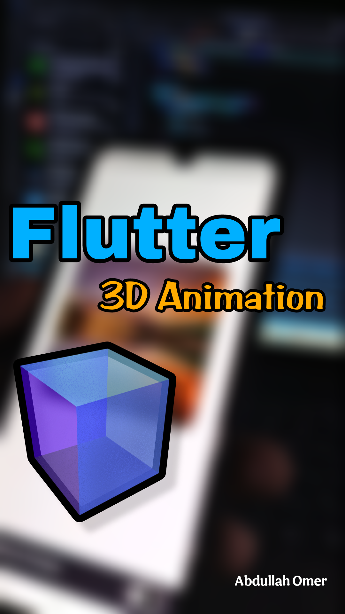

# 3D-Animation-with-Flutter
3D Animation with Flutter ( Mobile App ) 🖼️ 

<a href="./img.png">
<!--   
  

</a> -->

## 🚀 المكتبة الرئيسية المستخدمة
- flutter_rotation_sensor

## تم تطويره بواسطة : Abdullah Omar

